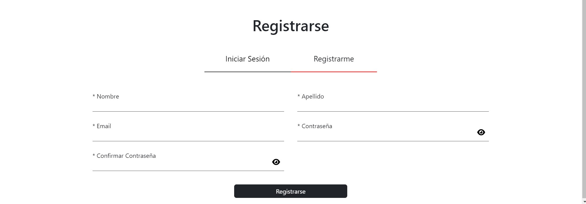
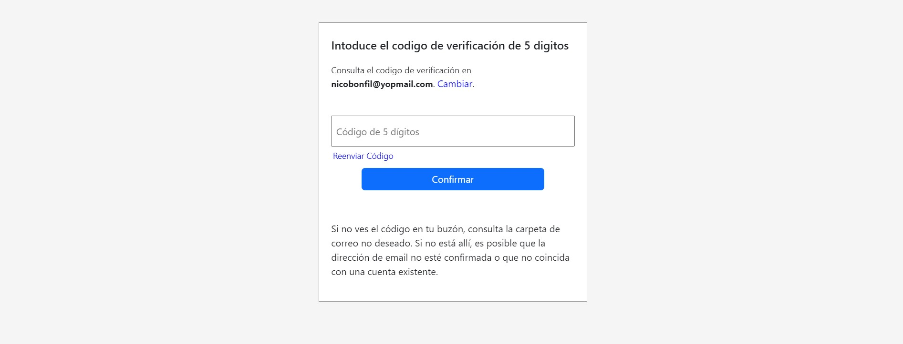
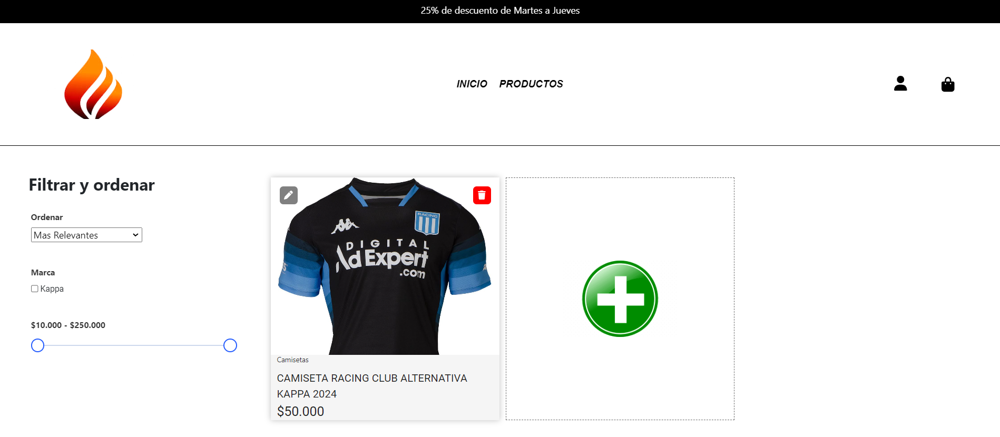
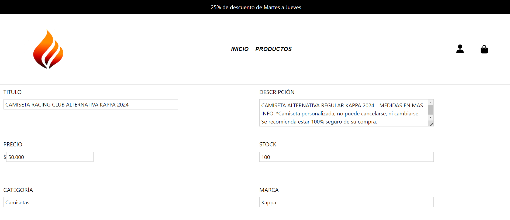
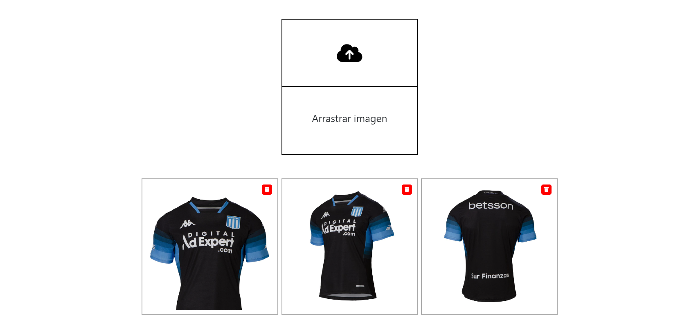
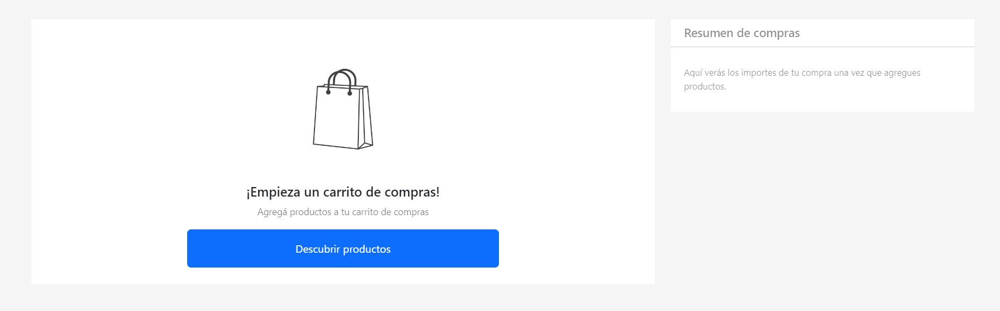
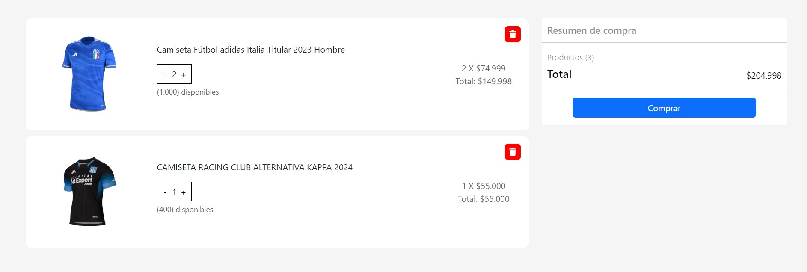
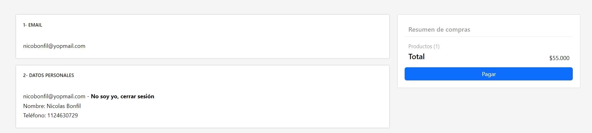
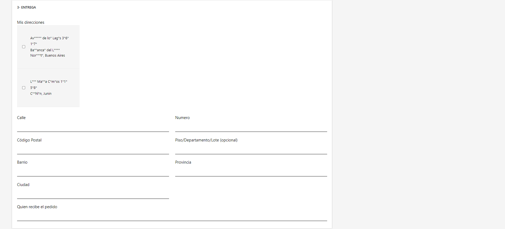

# ECOMMERCE
¡Bienvenido a mi primer ecommerce utilizando MERN (MongoDB, ExpressJs, ReactJs and NodeJs)!

DEMO: https://nicoecommerce.netlify.app/

### Características principales

##### - Users: 
Para el login se utilizó un sistema de token con Jsonwebtoken alamcenada en una cookie para guardar la información del usuario. Cuando un usuario nuevo es creado, la contraseña se hashea utiliznado Bcrypt para almacenarla en la base de datos de manera segura. Intoduciendo un código de verificación que llega a tu correo, podes restablecer tu contraseña si te la olvidaste.

-Usuario y contraseña ADMIN:
Usuario: soyadmin
Contraseña: soyadmin

   

##### - Products:
 Mediante las operaciones CRUD el usuario ADMIN puede crear, editar y eliminar un producto si asi lo desea. El ADMIN puede subir imagenes en la creación y edición del producto a través de multer. El usuario puede agregar su producto y la cantidad deseada a su carrito de compras.

   

#### - Cart:
Desde el carrito de compras podes actualizar  la cantidad de productos que quieras o eliminar el producto del carrito.

 

#### -Checkout;
Completa tu información y agregá tu dirección o elegí una ya guardada para finalizar el proceso de compra.

 

 
### Herramientas utilizadas
- GITHUB
- MONGODB
- EXPRESSJS
- REACT VITE
- NODEJS
- CSS3
- BOOTSTRAP
- AXIOS
- MULTER
- NODEMAILER
- JsonWebToken
